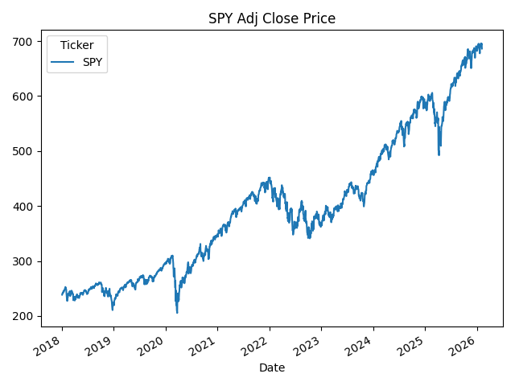

# financial-data-analysis-python
Python-based financial data analysis project focusing on return, volatility, and risk evaluation

## Overview 

This project analyzes financial time-series data of the S&P 500 ETF (SPY) using Python. 
Daily returns were computed based on adjusted closing prices to evaluate return and risk characteristics. 
Key metrics such as mean daily return, volatility, and maximum drawdown (MDD) were calculated. 
The results demonstrate how quantitative indicators can support data-driven investment decision-making. 

##Key Results 

- Mean daily return : ~0.06%
- Daily volatility (standard deviation): ~1.22%%
- Maximum drawdown (MDD) : ~34%
- Analysis period: from 2018-01-01

## Price Trend Visualization

